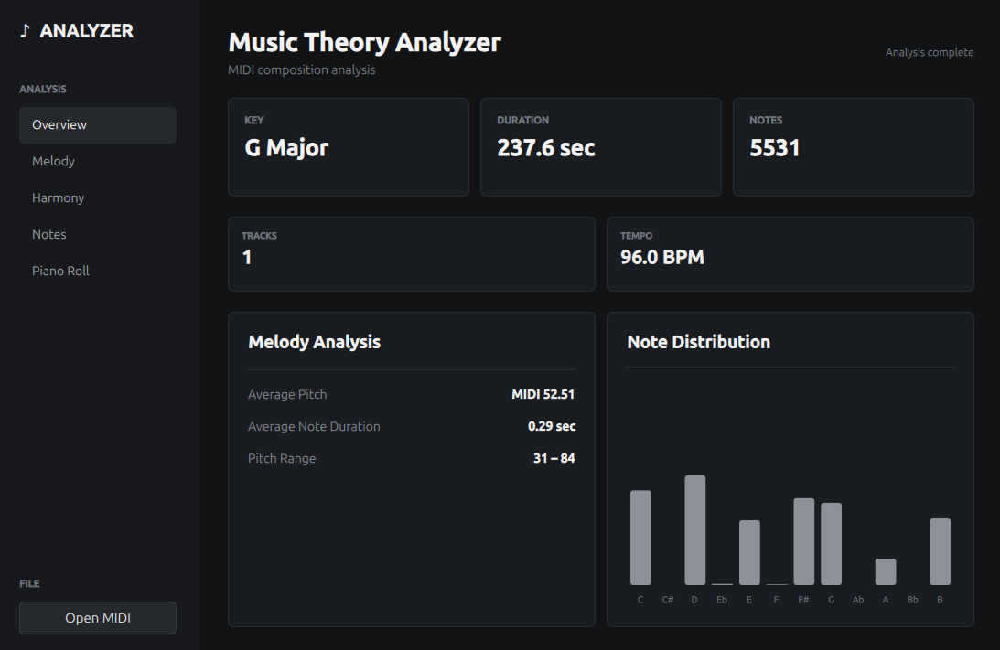

# MIDI Analyzer



MIDI Analyzer is a Linux desktop application for analyzing MIDI files
and exploring their musical structure. It combines MIDI data analysis,
music-theory information, visualizations, and playback in one interface.

## Features

### MIDI Analysis

Load a MIDI file and inspect: - Track count - Duration - Tempo -
Pitch-class frequency - Detected key - Melody statistics - Chord
progression - Piano-roll data

### Key Detection

The analyzer estimates the musical key of a MIDI composition, including
major and minor tonalities.

### Note Distribution

The **Notes** view shows the frequency of the twelve pitch classes:

`C, C#/Db, D, D#/Eb, E, F, F#/Gb, G, G#/Ab, A, A#/Bb, B`

This gives a quick visual indication of which notes are most prominent
in the MIDI.

### Melody

The **Melody** view provides statistics about melodic note activity and
the musical material contained in the MIDI.

### Harmony

The **Harmony** view analyzes harmonic content and presents a
duration-weighted chord progression, helping you inspect how the harmony
develops through the piece.

### Piano Roll

The **Piano Roll** view provides a timeline-based visualization of MIDI
notes, making pitch, timing, duration, overlaps, chords, and musical
phrases easier to inspect.

### MIDI Playback

MIDI Analyzer includes playback using FluidSynth together with Qt audio
functionality, allowing you to listen to the MIDI while examining its
analysis.

## Interface

The application is organized into focused analysis views:

  -----------------------------------------------------------------------
  View                                Purpose
  ----------------------------------- -----------------------------------
  **Overview**                        General MIDI information and
                                      detected musical characteristics

  **Melody**                          Melody-related statistics

  **Harmony**                         Chord and harmonic progression
                                      analysis

  **Notes**                           Pitch-class frequency and note
                                      distribution

  **Piano Roll**                      Visual timeline of MIDI notes
  -----------------------------------------------------------------------

## Technology

-   **C++17**
-   **Qt 6**
-   **Qt Quick / QML**
-   **Qt Multimedia**
-   **CMake**
-   **FluidSynth**
-   **Craig Sapp's midifile library**
-   **Flatpak**

The core MIDI processing uses the `midifile` library, included in
`third_party/midifile/`.

## Build from Source

### Requirements

A Linux development environment with:

-   C++17 compiler
-   CMake
-   Qt 6
-   Qt Quick
-   Qt Quick Controls 2
-   Qt Multimedia
-   FluidSynth
-   pkg-config

### Clone

``` bash
git clone https://github.com/userusv/MusicTheoryAnalyzer.git
cd MusicTheoryAnalyzer
```

### Build

``` bash
mkdir build
cd build
cmake ..
cmake --build .
```

Run the application with:

``` bash
./MusicTheoryAnalyzerApp
```

## Flatpak

MIDI Analyzer is packaged as a Flatpak application.

**Application ID:**

``` text
io.github.userusv.MusicTheoryAnalyzer
```

Flatpak packaging files are located in:

``` text
packaging/
```

The package includes the application manifest, desktop entry, AppStream
metadata, and application icon.

## Project Structure

``` text
MusicTheoryAnalyzer/
├── CMakeLists.txt
├── LICENSE
├── Main.qml
├── main.cpp
├── README.md
├── packaging/
│   ├── io.github.userusv.MusicTheoryAnalyzer.desktop
│   ├── io.github.userusv.MusicTheoryAnalyzer.metainfo.xml
│   ├── io.github.userusv.MusicTheoryAnalyzer.svg
│   └── io.github.userusv.MusicTheoryAnalyzer.yml
├── screenshots/
│   └── main-window.png
└── third_party/
    └── midifile/
```

## Privacy

MIDI Analyzer is designed as a local desktop application. MIDI files are
analyzed locally and the application does not require an online account
for MIDI analysis.

The project is intended to avoid embedding personal home-directory paths
in the source code.

## License

MIDI Analyzer is released under the **MIT License**.

Third-party components retain their respective licenses. See `LICENSE`
and the license files included with third-party dependencies.

## Contributing

Bug reports, feature requests, improvements, and contributions are
welcome through GitHub.

## Repository

https://github.com/userusv/MusicTheoryAnalyzer
